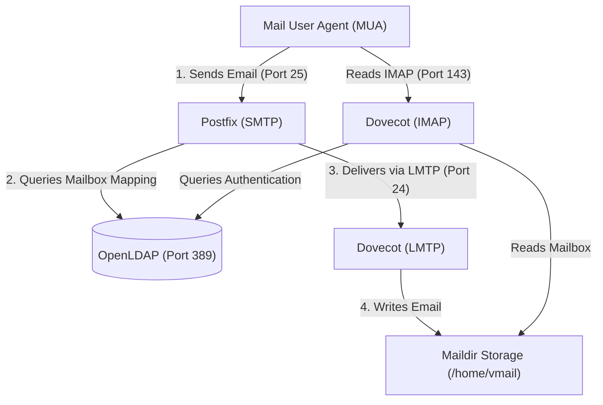

# Integrated Mail Server Stack (SMTP + IMAP + OpenLDAP)

This repository implements a fully containerized mail server infrastructure using Postfix (SMTP), Dovecot (IMAP/LMTP), and OpenLDAP (Directory Service). It is designed to provide centralized user authentication and dynamic virtual mailbox delivery.

---

## Architecture Overview

The following diagram illustrates the email flow and integration between the mail user agent (MUA), the mail servers, and the LDAP directory service:



---

## Component Specifications

### 1. Directory Server (OpenLDAP) — `./ldap`
- **Base Image:** `debian:12-slim` containing `slapd` and `ldap-utils`.
- **Schema Injection:** On initial startup, the `entrypoint.sh` script dynamically compiles and registers the `misc.schema` and `courier.schema` files (required for the `CourierMailAccount` object class).
- **Persistence:** Persists LDAP data and system configurations using host-mounted volumes (`./ldap/data` and `./ldap/config`). Destructive initialization is automatically skipped if an existing database is detected.
- **Default Domain:** Configured to `frijoli.com` with the default admin password `admin123`.

### 2. Mail Transfer Agent (Postfix SMTP) — `./smtp`
- **Base Image:** `debian:12-slim` with `postfix` and `postfix-ldap`.
- **Virtual Domains:** Resolved dynamically from `/etc/postfix/vdomains.txt` (defines virtual domains like `frijoli.com`, `diana.frijoli.com`).
- **LDAP Lookups:** Employs `ldapmaps.cf` to map the target recipient email (`mail` attribute) to its corresponding mailbox subdirectory (`mailbox` attribute).
- **Chroot Disabled:** All daemons in `master.cf` run with `chroot = n`. This bypasses Postfix's default container jail, allowing the system to communicate with the LDAP container and external networks without connectivity issues.
- **LMTP Delivery:** Leverages the `virtual_transport = lmtp:inet:imap:24` configuration to forward incoming emails directly to Dovecot's LMTP listener.

### 3. Mail Delivery and IMAP Server (Dovecot) — `./imap`
- **Base Image:** `debian:12-slim` with `dovecot-core`, `dovecot-imapd`, `dovecot-lmtpd`, and `dovecot-ldap`.
- **Permission Management:** Configured with a dedicated `vmail` system user/group (UID/GID `1005`) which owns the mail storage.
- **Authentication (Passdb/Userdb):** Configured in `/etc/dovecot/dovecot-ldap.conf.ext`. Utilizes LDAP filters to support credentials lookups using either the full email address (`mail`) or username (`uid`):
  - `pass_filter` / `user_filter`: `(&(objectClass=CourierMailAccount)(|(mail=%{user})(uid=%{user})))`
- **Dynamic Storage Path:** Mails are stored dynamically based on the LDAP `mailbox` attribute value by mapping it to the Dovecot Maildir location:
  `user_attrs = homeDirectory=home, uidNumber=uid, gidNumber=gid, mailbox=mail=maildir:/home/vmail/%$`
- **LMTP Service:** Listens on port `24` inside the container network to accept incoming deliveries from Postfix.

---

## Deployment and Setup

### Step 1: Configure Host Permissions
Since the containers use UID/GID `1005` to write data to the shared volume `/home/vmail`, you must ensure the directory exists on the host and has the proper ownership:

```bash
sudo mkdir -p /home/vmail
sudo chown -R 1005:1005 /home/vmail
sudo chmod -R 770 /home/vmail
```

### Step 2: Build the Container Images Locally
If the remote Docker Registry images (`lcarles2d/*`) are unavailable, build them locally using:

```bash
docker build -t lcarles2d/openldap:pdc ./ldap
docker build -t lcarles2d/postfix:pdc ./smtp
docker build -t lcarles2d/dovecot:pdc ./imap
```

### Step 3: Run the Stack
Start the services in the background using Docker Compose:

```bash
docker-compose up -d
```

Verify the status of the containers:

```bash
docker-compose ps
```

---

## LDAP User Management

To allow SMTP and IMAP servers to process user mailboxes, users must be registered in the OpenLDAP directory under `ou=usuarios,dc=frijoli,dc=com` with the `CourierMailAccount` object class.

### Example LDIF File (`user.ldif`):
Create a file containing the LDAP user entry:

```ldif
dn: uid=luis,ou=usuarios,dc=frijoli,dc=com
objectClass: inetOrgPerson
objectClass: posixAccount
objectClass: CourierMailAccount
cn: Luis Frijoli
sn: Frijoli
uid: luis
uidNumber: 1005
gidNumber: 1005
homeDirectory: /home/vmail
mail: luis@frijoli.com
mailbox: frijoli.com/luis
userPassword: admin123
```

> [!NOTE]
> - The `mail` attribute (`luis@frijoli.com`) is queried by Postfix for recipient address validation.
> - The `mailbox` attribute (`frijoli.com/luis`) defines the target subdirectory inside the `/home/vmail/` storage folder.

### Import the entry to LDAP:
Run the command from your host machine (pointing to the exposed port `389`):

```bash
ldapadd -x -H ldap://localhost:389 -D "cn=admin,dc=frijoli,dc=com" -w admin123 -f user.ldif
```

---

## Verification and Testing

### 1. Test SMTP Delivery (Port 25)
Simulate sending an email by connecting to the SMTP service via netcat:

```bash
nc localhost 25
```
*(Send the following SMTP command sequence line by line)*
```smtp
EHLO localhost
MAIL FROM: <sender@external.com>
RCPT TO: <luis@frijoli.com>
DATA
Subject: SMTP Integration Test

Hello Luis, this email confirms a successful SMTP -> LMTP -> Maildir delivery flow.
.
QUIT
```

### 2. Verify Delivery on the Filesystem
Inspect the shared mailbox directory to ensure the email file was successfully written:

```bash
sudo ls -R /home/vmail/frijoli.com/luis/new/
```

### 3. Test IMAP Authentication and Fetching (Port 143)
Verify that the mailbox can be read using Dovecot IMAP:

```bash
nc localhost 143
```
*(Authenticate and fetch the message)*
```imap
. LOGIN luis admin123
. SELECT INBOX
. FETCH 1 BODY[TEXT]
. LOGOUT
```

---

## Directory Structure

```text
├── docker-compose.yaml        # Docker Compose service definition
├── ldap/
│   ├── Dockerfile             # OpenLDAP image build instructions
│   └── entrypoint.sh          # Dynamic schema compiler and slapd entrypoint
├── smtp/
│   ├── Dockerfile             # Postfix build instructions
│   ├── main.cf                # Postfix configuration (LMTP delivery, LDAP mapping)
│   ├── master.cf              # Service definition and chroot bypass configurations
│   ├── ldapmaps.cf            # LDAP query properties for virtual mailbox resolution
│   └── vdomains.txt           # Authorized virtual domains list
└── imap/
    ├── Dockerfile             # Dovecot build instructions
    ├── dovecot.conf           # Main configuration file entrypoint
    ├── dovecot-ldap.conf.ext  # LDAP database authentication and mapping rules
    └── conf.d/                # Modular Dovecot settings:
        ├── 10-auth.conf       # Authentication protocols configuration
        ├── auth-ldap.conf.ext # LDAP driver declaration for passdb and userdb
        ├── 10-logging.conf    # Internal logging properties
        ├── 10-mail.conf       # Mailbox location and system user configurations
        └── 10-master.conf     # Service listeners (IMAP port 143, LMTP port 24)
```
